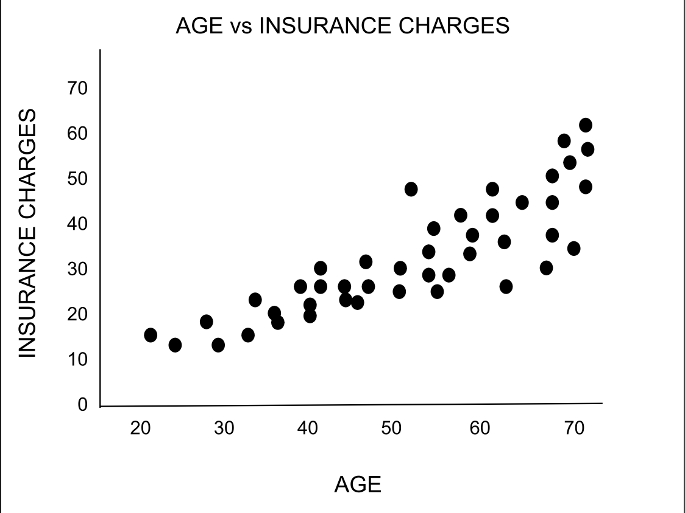

# Data Visualization Project

## Data

The data I propose to visualize for my project is a dataset that describes information about individuals and how much they pay in health insurance charges. From this dataset, some informaqtion like age, sex, smoker, and region are things that stand out as interesting. 


## Questions & Tasks

The following tasks and questions will drive the visualization and interaction decisions for this project:

 * How do insurance charges change as people get older?
 * Is there a correlation between being a smoker and how much insurance charges are?
 * Are there are any relationships between health insurance charges and what region a person is from?

## Sketches

)


## Prototypes

I’ve created a proof of concept visualization of this data. It's a ... and it shows ...

[](https://vizhub.com/curran/eab039ad1765433cb51aad167d9deae4)

(please put a screenshot of one or more visualizations of this dataset you already made, for previous assignments, and link to them)

You can put images into here by pasting them into issues.

You can make images into links like this:

```
[](https://vizhub.com/curran/eab039ad1765433cb51aad167d9deae4)
```


Also, you can study the [source](https://raw.githubusercontent.com/curran/dataviz-project-template-proposal/master/README.md) to figure out Markdown formatting. You can use the GitHub built-in editor to edit the document.

## Open Questions

(describe any fear, uncertainty, or doubt you’re having about the feasibility of implementing the sketched system. For example, “I’m not sure where to get the geographic shapes to build a map from this data” or “I don’t know how to resolve the codes to meaningful names” … Feel free to delete this section if you’re confident.)

## Milestones

(for each week, estimate what would be accomplised)
