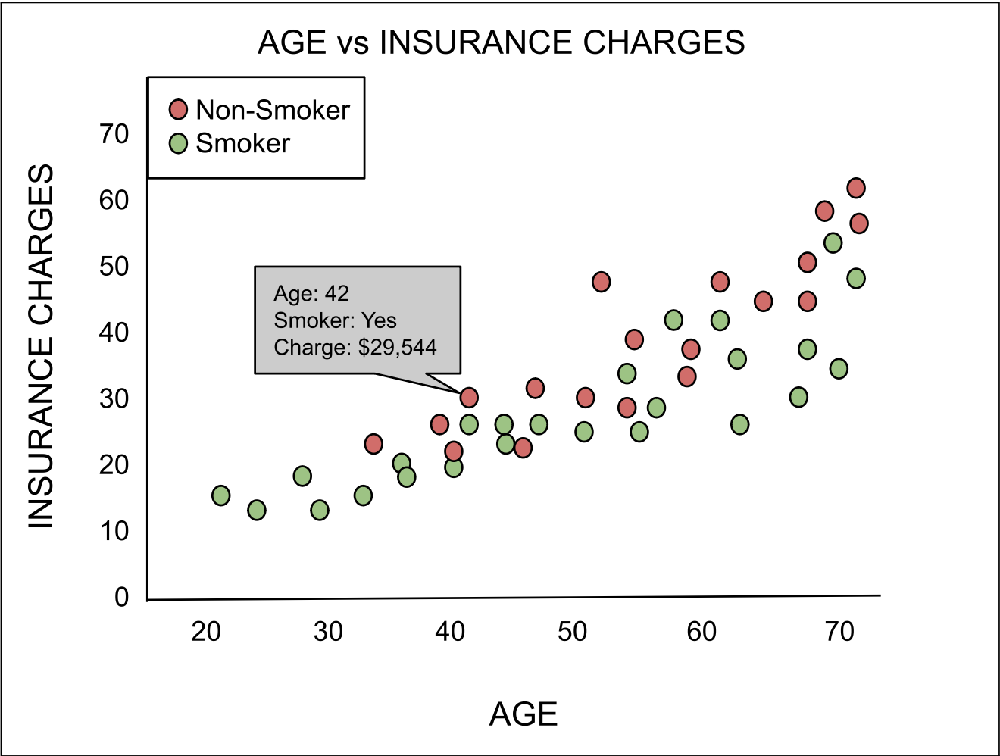
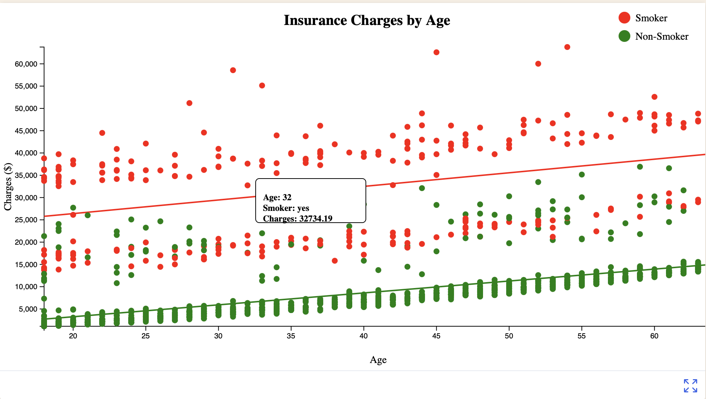
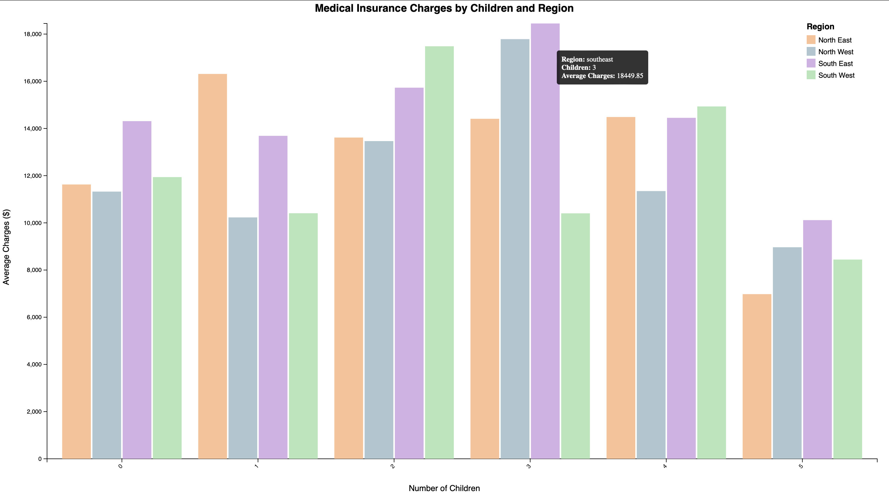
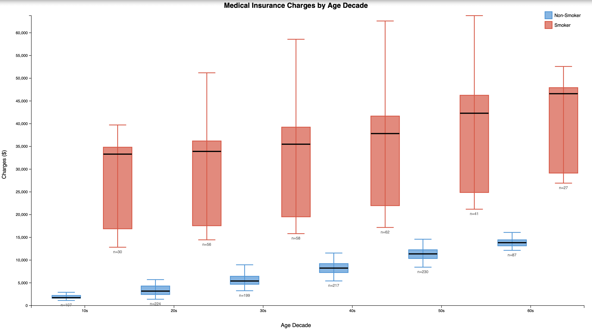
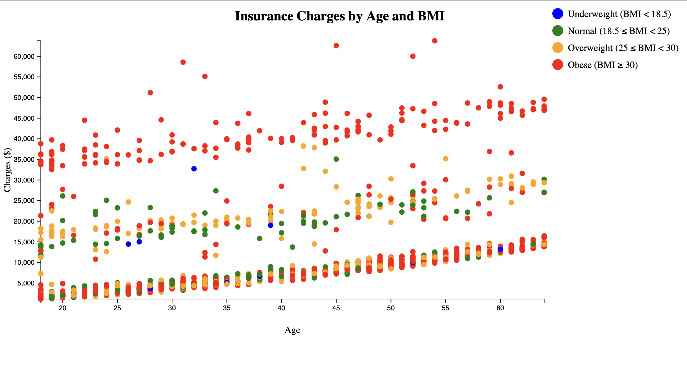
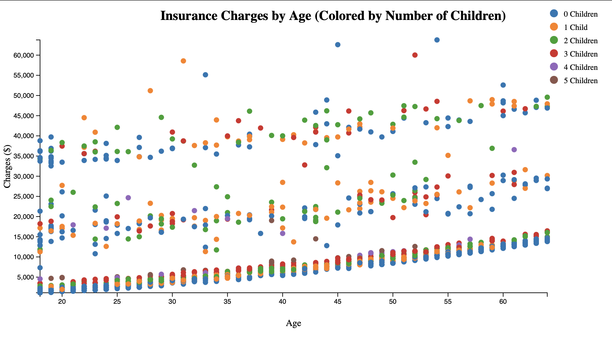
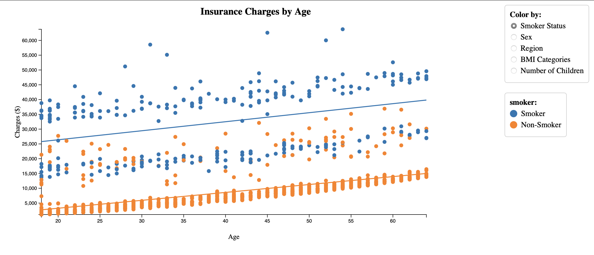

# Data Visualization Project

## Data

The data I propose to visualize for my project is a dataset that describes information about individuals and how much they pay in health insurance charges. From this dataset, some informaqtion like age, sex, smoker, and region are things that stand out as interesting. I obtained this data set from https://www.kaggle.com/datasets/mosapabdelghany/medical-insurance-cost-dataset.

## Questions & Tasks

The following tasks and questions will drive the visualization and interaction decisions for this project:

 * How do insurance charges change as people get older?
 * Is there a correlation between being a smoker and how much insurance charges are?
 * Are there are any relationships between health insurance charges and what region a person is from?

## Sketches

This first sketch is a very basic graph comparing age to insurance charges, predicting that charges will increase with age.

This iterated sketch adds colors indicating whether the individual is a smoker, as well as adding a tooltip that displays more information about the individual.

## Prototypes

I first created a proof of concept visualization of this data. It's a scatterplot and it shows the relationship between age, smoking, and health insurance charges. It also shows a trendline for smokers and non-smokers and includes a tooltip showing more information.

I also created another visualization that describes that relationship between number of children, region, and insurance charges through grouped bar graphs.

I then went back and edited my original prototype in order to make a cleaner look using boxplots. Since there are so many datapoints, it would be easier to understand statistics like median using boxplots. I also added the number of indidividuals in each category.

Going back, I tried to fully understand my data and attempted to find the most interesting relationships. Here, I visualized BMI and number of children in the graph comparing age and insurance charges.

After seeing these visualizations, I wanted to create a new visualization that combined all of this information, leading to my fourth prototype, which includes a attribute selection pane that allows all attributes to be visualized.

## Open Questions

I am interested in the data and the visualization, but I feel like the visualizations I have made are too simple. I am worried that there is not enough information or that I could be doing more with this dataset. I have added the data that I think is interesting and interactivity, but I could potentially somehow add even more attributes into the visualization or go a completely different route in order to make a more interesting creation.

## Milestones

For each week in the course, I plan to add new information and transform my simple graph into something beautiful.

End of September: Consider what my final visualization will look like.

End of October: Add small details in order to make a more interesting and informative visualization.

End of November: Add depth that conveys the most information possible and allows viewers to extract conclusions from it.

End of course: Create a finished product.
